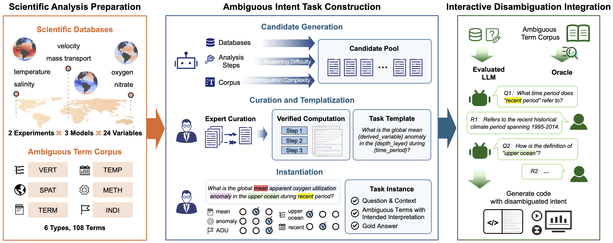
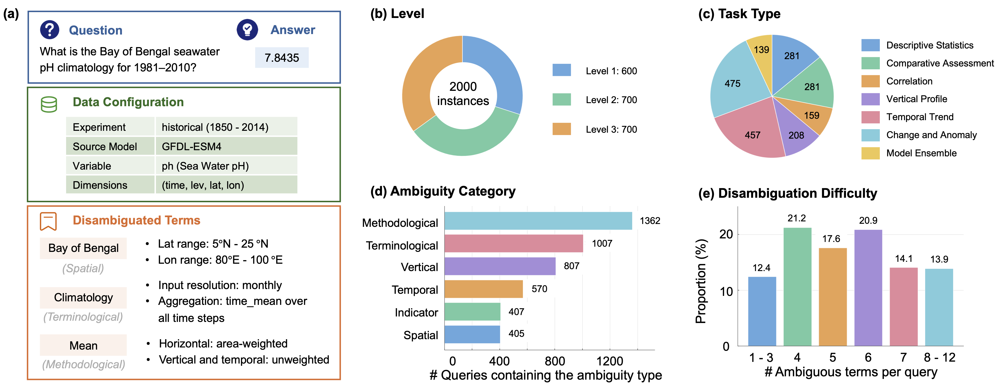

<div align="center">

# Can LLMs <i>FATHOM</i> Ambiguous Intent in Scientific Data Analysis?

Luyu Han<sup>1</sup>, Bin Lu<sup>1</sup>, Shangzhi Yuan<sup>1</sup>, Lei Zhou<sup>1</sup>, Xinbing Wang<sup>1</sup>, Chengshan Wang<sup>2</sup>, Meng Jin<sup>1</sup>

<sup>1</sup> Shanghai Jiao Tong University &nbsp;&nbsp;, &nbsp;&nbsp; <sup>2</sup> China University of Geosciences

</div>

---

## 1. Overview

<i>FATHOM</i> is a benchmark for evaluating **ambiguity handling** in LLM-based **scientific data analysis**. Unlike existing scientific-analysis benchmarks that assume well-defined user requests, <i>FATHOM</i> studies whether models can identify ambiguous scientific intent and proactively ask clarification questions before performing downstream analysis. Developed in collaboration with Earth science experts, the benchmark features expert-verified ambiguous scientific queries, a three-level ambiguity hierarchy, and a structured taxonomy for fine-grained evaluation of intent disambiguation.

This repository provides the complete benchmark construction pipeline, including the data generation framework, benchmark datasets, and evaluation code, enabling reproducible research on ambiguity-aware scientific data analysis. The overall workflow of Fathom is illustrated below.

<div align="center">
  
</div>

### 1.1 Repository Structure

```text
.
├── configs/                        # YAML configs for different stages
│   ├── data_gen.yaml               #   dataset generation
│   ├── runner.yaml                 #   RQ1 — autonomous disambiguation run
│   ├── runner_modular.yaml         #   RQ2 — agent-assisted disambiguation run / RQ3 - ambiguity recognition run
│   ├── evaluate.yaml               #   metrics for runner.yaml outputs
│   └── evaluate_modular.yaml       #   metrics for runner_modular.yaml outputs
├── data/
│   ├── scientific_database/        # CMIP6 NetCDF (full/ full download list, test/ subset)
│   ├── ambiguous_term_corpus.jsonl # expert-verified ambiguous terms
│   ├── QA_dataset/                 # full/ 2,000 QA pairs + test/ subset
│   └── templates/                  # task and prompt templates used by generation
├── src/
│   ├── generate.py                 # data-generation entry point
│   ├── run.py                      # RQ1 — autonomous disambiguation experiment
│   ├── run_modular.py              # RQ2 — agent-assisted disambiguation experiment / RQ3 - ambiguity recognition experiment
│   ├── evaluate.py                 # metrics for the autonomous setting
│   ├── evaluate_modular.py         # metrics for the modular settings
│   ├── data_gen/                   # dataset construction (see data_gen/README.md)
│   ├── runner/                     # LLM client, ambiguity detection, clarification, code execution
│   ├── eval/                       # simulated-user oracle + metric computation
│   └── utils/                      # CMIP6 I/O, numerical diagnostics, domain knowledge
├── assets/
├── requirements.txt
└── README.md
```

Sections [3.1](#31-data-generation) and [3.2](#32-reproducing-the-experiments) explain how each
component is run and reproduced.

---

## 2. Data

### 2.1 Scientific Database

<i>FATHOM</i> is built on a curated subset of the CMIP6 climate archive. All benchmark questions are answered by executing code over the corresponding NetCDF files, so the scientific database is required before running the evaluation.

- **Default location:** `data/scientific_database/`
- **`full/`**: the complete set (>800 GB) of CMIP6 files used by the benchmark. The folder provides a manifest listing all required file metadata and the information needed to retrieve each file from the official ESGF search portal (https://esgf-metagrid.cloud.dkrz.de/search).
  together with its download link. Follow that list to fetch the data locally.
- **`test/`**: a lightweight subset (<4 GB) for quick reproduction. It contains file metadata required by the benchmark test split, allowing the complete evaluation pipeline to be run without downloading the full scientific database.

For convenience, we also provide the curated CMIP6 subset on Hugging Face (https://huggingface.co/datasets/Luyu-H/CMIP6_scientific_database_for_FATHOM). We recommend starting with the **`test/`** subset for quick reproduction, and downloading the full dataset only when reproducing the complete benchmark.

The active data root is set by `data.data_root` in the runner configs. By default, the runner uses the `test` subset.

### 2.2 Ambiguous Term Corpus

- **Location:** `data/ambiguous_term_corpus.jsonl`

An expert-verified lexicon of 108 ambiguous terms spanning **six ambiguity categories**: Spatial, Terminological, Temporal, Methodological, Indicator, and Vertical. Each entry records the term's surface forms, its category, the concrete parameters it maps to (`mapped_params`), and a `reasoning_note` describing the intended resolution. This corpus grounds both dataset generation and the simulated-user oracle used during evaluation.

### 2.3 QA Dataset

- **Location:** `data/QA_dataset/full/`, with a `test/` subset for fast reproduction

<i>FATHOM</i> contains **2,000 question–answer pairs** organized by a three-level difficulty hierarchy:

| Level | # Items | Ambiguity | Description |
|:-----:|:-------:|:---------:|:------------|
| **L1** |  600 | none (baseline) | Well-specified tasks that isolate raw analysis capability. |
| **L2** |  700 | ambiguous | Ambiguous queries requiring intent disambiguation. |
| **L3** |  700 | ambiguous / query | Ambiguous queries with higher reasoning complexity. |

Each item provides the natural-language `question`, the executable-grounded `answer`, and the gold `ambiguous_terms` and `ambiguous_term_ids` linking back to the corpus in Section 2.2. The `test/` set mirrors this schema over the small scientific-data subset for quick end-to-end runs.

<div align="center">
  
</div>

---

## 3. Getting Started

**Environment.** Python ≥ 3.10 is recommended.

```bash
conda create -n fathom python=3.12 -y
conda activate fathom
pip install -r requirements.txt
```

**API keys.** LLM access is read from environment variables. Each config's `api_key_env` field names the variable to use. Export the keys for the providers you intend to run, e.g.:

```bash
export OPENAI_API_KEY=...        # OpenAI
export ANTHROPIC_API_KEY=...     # Anthropic
export DEEPSEEK_API_KEY=...      # DeepSeek
export DASHSCOPE_API_KEY=...     # Qwen
export GEMINI_API_KEY=...        # Gemini
```

All commands below are run from the repository root.

### 3.1 Data Generation

The released QA dataset and term corpus are ready to use, so data generation is only needed to **regenerate or extend** the benchmark. The pipeline is driven by `configs/data_gen.yaml`:

```bash
python -m src.generate
```

> Detailed configuration options and stage-by-stage instructions are available in
> **[`src/data_gen/README.md`](src/data_gen/README.md)**.

### 3.2 Experiment

By default, the runner configurations target the **`test`** split. Download the test set by running:

```bash
python data/scientific_database/test/download_testset.py
```

Do not modify the directory structure or file names in the scientific database, as the runner relies on the original layout.

All runs write to `outputs/<run_name>/{full_records,summary}/`, and the evaluation scripts write metric reports to `outputs/<run_name>/metrics/`.

#### Setting 1 — Autonomous Disambiguation (RQ1)

This setting allows LLMs to decide on its own whether to answer directly or ask a clarifying question (`clarification.strategy=spontaneous`). Configured by `configs/runner.yaml`:

```bash
# Run a model and override provider / model / key-env
python -m src.run llm.provider=openai llm.model=gpt-5.4 llm.api_key_env=OPENAI_API_KEY

# Compute metrics over the run(s)
python -m src.evaluate
```

#### Setting 2 — Agent-Assisted Disambiguation (RQ2)

Ambiguous tasks can also be evaluated with a structured clarification loop against a simulated-user oracle before code generation. Configured by `configs/runner_modular.yaml` with `mode=clarification_only` and `clarification.strategy ∈ {direct, planning, candidate}`:

```bash
python -m src.run_modular mode=clarification_only clarification.strategy=planning
python -m src.evaluate_modular eval.mode=clarification_only
```

#### Setting 3 - Ambiguity Recognition (RQ3)

To measure how well models recognize ambiguity of the given query when explicitly asked, run the ambiguity-only mode:

```bash
python -m src.run_modular mode=ambiguity_only
python -m src.evaluate_modular eval.mode=ambiguity_only
```

---

## 4. Main Results

**Table 1 — End-to-end results** under the autonomous (RQ1) and agent-assisted (RQ2) disambiguation settings. Accuracy and Exec. Rate are higher-is-better (↑), and Incorrect among Exec. is lower-is-better (↓). *Clarify:* ✗ = never clarifies spontaneously, ◐ = occasionally clarifies, ✓ = clarification enforced.

| Setting | Model / Strategy | Clarify | Acc L1 | Acc L2 | Acc L3 | **Acc All** ↑ | Exec L1 | Exec L2 | Exec L3 | **Exec All** ↑ | Inc L1 | Inc L2 | Inc L3 | **Inc All** ↓ |
|:-------:|:-----------------|:-------:|:------:|:------:|:------:|:-------:|:-------:|:-------:|:-------:|:--------:|:------:|:------:|:------:|:--------:|
| **Autonomous (RQ1)** | GPT-5.4 | ✗ | 0.805 | 0.483 | 0.290 | **0.512** | 0.975 | 0.879 | 0.901 | **0.915** | 0.170 | 0.396 | 0.611 | **0.404** |
| | OpenAI o3 | ◐ | 0.772 | 0.406 | 0.274 | **0.469** | 0.870 | 0.783 | 0.761 | **0.801** | 0.100 | 0.377 | 0.487 | **0.333** |
| | DeepSeek-V4-Flash | ✗ | 0.777 | 0.345 | 0.207 | **0.426** | 0.888 | 0.728 | 0.614 | **0.736** | 0.112 | 0.384 | 0.407 | **0.310** |
| | Qwen3-Max | ✗ | 0.905 | 0.393 | 0.270 | **0.503** | 0.965 | 0.887 | 0.761 | **0.867** | 0.062 | 0.494 | 0.491 | **0.363** |
| | Claude Sonnet 4.6 | ✗ | 0.875 | 0.469 | 0.330 | **0.542** | 0.992 | 0.990 | 0.961 | **0.981** | 0.117 | 0.521 | 0.631 | **0.439** |
| **Agent-Assisted (RQ2)** | Direct | ✓ | -- | 0.711 | 0.530 | **0.621** | -- | 0.997 | 0.933 | **0.965** | -- | 0.286 | 0.403 | **0.344** |
| | Planning | ✓ | -- | 0.697 | 0.594 | **0.646** | -- | 0.996 | 0.946 | **0.971** | -- | 0.299 | 0.351 | **0.325** |
| | Candidate | ✓ | -- | 0.674 | 0.580 | **0.627** | -- | 0.993 | 0.940 | **0.966** | -- | 0.319 | 0.360 | **0.339** |
| | _Avg._ | ✓ | -- | 0.694 | 0.568 | **0.631** | -- | 0.995 | 0.940 | **0.967** | -- | 0.301 | 0.371 | **0.336** |

**Table 2 — Accuracy decomposed by ambiguity category and by disambiguation difficulty** (number of ambiguous terms per query). Categories: VERT = Vertical, SPAT = Spatial, TERM = Terminological, TEMP = Temporal, METH = Methodological, INDI = Indicator.

| Setting | Model / Strategy | VERT | SPAT | TERM | TEMP | METH | INDI | 1–3 | 4 | 5 | 6 | 7 | 8–12 |
|:-------:|:-----------------|:----:|:----:|:----:|:----:|:----:|:----:|:---:|:---:|:---:|:---:|:---:|:----:|
| **Autonomous (RQ1)** | GPT-5.4 | 0.312 | 0.289 | 0.400 | 0.391 | 0.371 | 0.209 | 0.767 | 0.286 | 0.486 | 0.370 | 0.330 | 0.144 |
| | OpenAI o3 | 0.245 | 0.185 | 0.331 | 0.326 | 0.328 | 0.214 | 0.753 | 0.273 | 0.366 | 0.312 | 0.315 | 0.108 |
| | DeepSeek-V4-Flash | 0.224 | 0.165 | 0.275 | 0.268 | 0.264 | 0.157 | 0.526 | 0.249 | 0.329 | 0.271 | 0.244 | 0.067 |
| | Qwen3-Max | 0.250 | 0.178 | 0.327 | 0.323 | 0.325 | 0.201 | 0.678 | 0.259 | 0.370 | 0.329 | 0.305 | 0.113 |
| | Claude Sonnet 4.6 | 0.315 | 0.279 | 0.402 | 0.395 | 0.383 | 0.253 | 0.828 | 0.310 | 0.455 | 0.363 | 0.325 | 0.211 |
| **Agent-Assisted (RQ2)** | Direct | 0.571 | 0.506 | 0.593 | 0.632 | 0.611 | 0.531 | 0.908 | 0.704 | 0.606 | 0.568 | 0.523 | 0.433 |
| | Planning | 0.615 | 0.516 | 0.636 | 0.693 | 0.638 | 0.521 | 0.914 | 0.646 | 0.654 | 0.630 | 0.589 | 0.474 |
| | Candidate | 0.601 | 0.491 | 0.634 | 0.667 | 0.619 | 0.450 | 0.925 | 0.646 | 0.598 | 0.613 | 0.563 | 0.454 |
| | _Avg._ | 0.596 | 0.505 | 0.621 | 0.664 | 0.623 | 0.500 | 0.916 | 0.666 | 0.619 | 0.604 | 0.558 | 0.454 |

---

## 5. Citation

```bibtex
% Coming soon.
```

---

## License

Released under the terms of the [LICENSE](LICENSE) file in this repository.